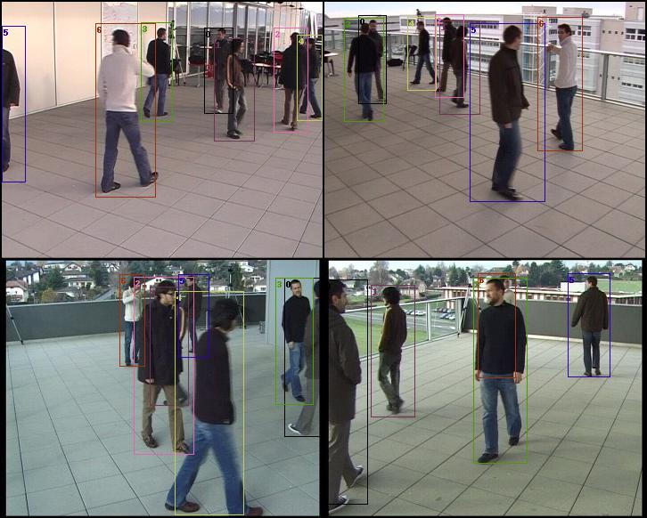
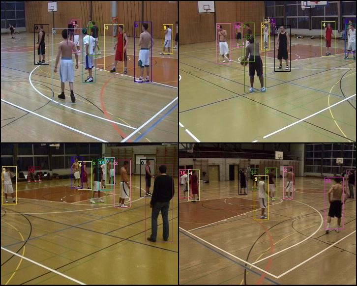
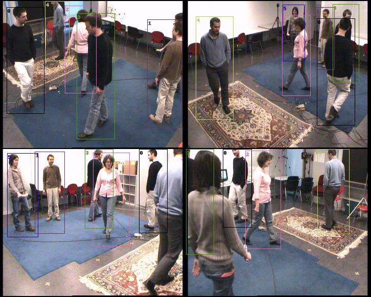

# GNN-CCA
This is a DGL implementation of [GNN-CCA](https://arxiv.org/abs/2201.06311) for multi-view detections.

The original GNN-CCA was implemented in [PyGeometric](https://github.com/pyg-team/pytorch_geometric). This repo re-implements in [DGL](https://github.com/dmlc/dgl). Both are using PyTorch.



## Installation
1. Install PyTorch (>= 1.9.0) and [DGL](https://www.dgl.ai/pages/start.html) (Python 3.7)
2. Install other requirements and [warmup_scheduler](https://github.com/ildoonet/pytorch-gradual-warmup-lr):
``` 
pip install -r requirements.txt
```
```
pip install git+https://github.com/ildoonet/pytorch-gradual-warmup-lr.git
```
3. Install [torchreid](https://github.com/KaiyangZhou/deep-person-reid) (follow its instruction)

## Preparation
### Dataset
Assume `DATA_NAME` is the directory in `dataset` folder.

1. Download dataset. Please refer to `dataset/${DATA_NAME}/README.md`
2. Run `python preprocess/${DATA_NAME}.py` with `${DATA_NAME}` be the lower case. For example:
```
python preprocess/epfl.py
```

### Model
1. Download ReID model from [here](https://drive.google.com/file/d/1nIrszJVYSHf3Ej8-j6DTFdWz8EnO42PB/view) and assume its path is `PATH_TO_REID_MODEL`.
2. You can also download the trained model from table below and assume its path is `PATH_TO_MODEL`.

| Model Name   | Download Link                                                                                                                                                                   | Train Dataset | Test Dataset | Performance |
|--------------|---------------------------------------------------------------------------------------------------------------------------------------------------------------------------------|---------------|--------------|-------------|
| gnn_cca_epfl | [Google Drive](https://drive.google.com/file/d/1gJs5pxpo6KAr6xhcRnM2EH2gL1hF7ztJ/view?usp=sharing) <br/> [Baidu Drive (m1he)](https://pan.baidu.com/s/1UoA7Hsc_G9NBRdtzjePPyg)  | EPFL          | EPFL         | See Table 1 |

_Note: all the trainings are under the same default configuration._

#### Table 1:
| Test Sequence | ARI    | AMI    | H      | C      | V-m    | ACC    |
|---------------|--------|--------|--------|--------|--------|--------|
| basketball    | 72.998 | 58.406 | 52.270 | 66.799 | 58.476 | 97.035 |
| laboratory    | 91.983 | 86.821 | 85.714 | 88.184 | 86.880 | 98.268 |
| passageway    | 71.211 | 66.528 | 64.718 | 80.970 | 67.081 | 93.573 |
| terrace       | 90.749 | 84.478 | 83.060 | 86.228 | 84.526 | 98.300 |

## Training
Training model on a specific dataset.

For example, training on EPFL dataset with all sequences:
```bash
python run.py --train --reid-path ${PATH_TO_REID_MODEL} --epfl --seq-name all
```
training on EPFL dataset with specific sequences:
```bash
python run.py --train --reid-path ${PATH_TO_REID_MODEL} --epfl --seq-name terrace passageway
```
You can also change the ReID model (served as the feature extractor) refer to [here](https://kaiyangzhou.github.io/deep-person-reid/MODEL_ZOO.html), and assume its name is `NAME_OF_REID_MODEL`.
Then you can train your model by running:
```bash
python run.py --reid-name ${NAME_OF_REID_MODEL} --reid-path ${PATH_TO_REID_MODEL} ...
```
After each epoch, the trained model will be saved in the directory assigned by `--output`.

Finally, denote `PATH_TO_MODEL` as the trained model.

## Testing
Testing model on a specific dataset.

For example, testing on EPFL dataset with all sequences:
```bash
python run.py --test --reid-path ${PATH_TO_REID_MODEL} --ckpt ${PATH_TO_MODEL} --epfl --seq-name all
```
and you can also plot the results of some sequences by adding `--visualize`:
```bash
python run.py --test --reid-path ${PATH_TO_REID_MODEL} --ckpt ${PATH_TO_MODEL} --epfl --seq-name terrace laboratory --visualize
```
The results will be saved in the directory assigned by `--output`.

## Results
Result of EPFL-basketball:



Result of EPFL-laboratory:



## Citation
```
@article{luna2022gnncca,
  title={Graph Neural Networks for Cross-Camera Data Association},
  author={Luna, Elena and SanMiguel, Juan C. and Martínez, José M. and Carballeira, Pablo},
  journal={arXiv preprint arXiv:2201.06311},
  year={2022}
}
```
